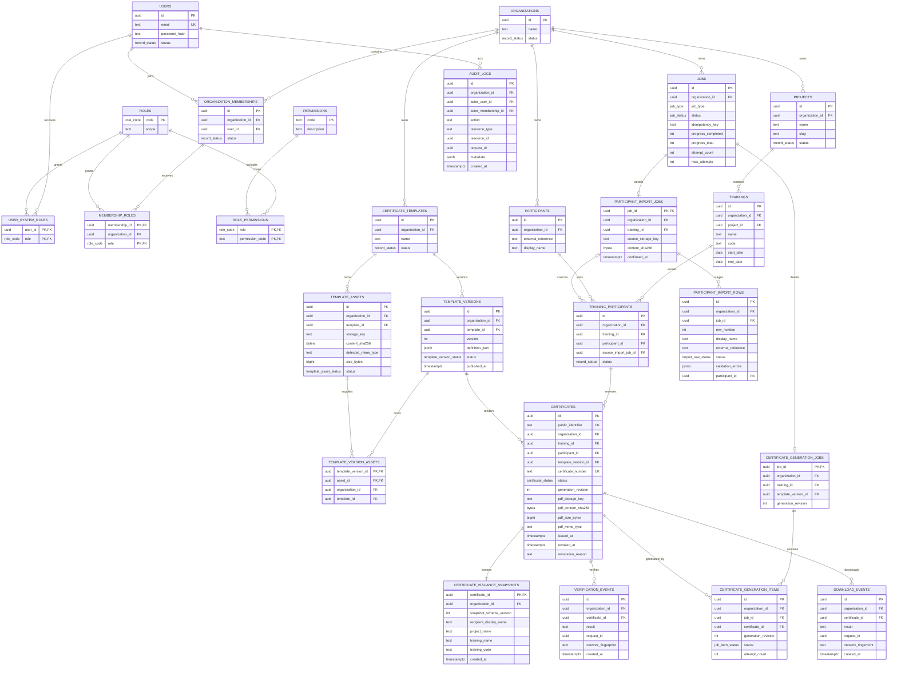

# 08 — Database ERD

## Scope

This ERD reflects the current logical database contract, including append-only migrations after the frozen Phase 0 snapshot in `docs/09-postgresql-schema.sql`. Internal primary keys are UUIDs. Public verification uses a separate random `certificates.public_identifier` and never exposes `certificates.id`.

## Core relationships

- Users are global identities; organization access is represented by memberships.
- Organization roles attach to memberships. `SUPER_ADMIN` attaches directly to a user as a system role.
- Every tenant-owned relationship includes `organization_id` and is enforced with composite foreign keys in the PostgreSQL schema.
- Participants join trainings through `training_participants` before certificates are issued.
- Background work uses a common job plus import/generation detail and item rows.
- Template versions and their asset links become immutable after publication.
- Certificates remain tied to the published template version and generation revision used to render them.
- Each certificate has exactly one immutable issuance snapshot containing the issuance-time human-readable binding values that would otherwise come from mutable participant/project/training rows.

## Mermaid ERD

## Enforced integrity rules

1. Composite foreign keys prevent projects, trainings, participants, template versions, jobs and certificates from being joined across organizations.
2. `SUPER_ADMIN` cannot be assigned through `membership_roles`; organization roles cannot use the system-role table.
3. `certificates.public_identifier` is random, globally unique and immutable. The internal certificate UUID is never a public token claim.
4. A certificate references an existing `training_participants` tuple in the same organization.
5. Published/archived template definition fields and asset links are protected by database triggers.
6. Version-to-asset links require the same organization and template. Assets used by published/archived versions cannot have their rendering content or storage identity changed.
7. Certificate issuance identity and the one-to-one issuance snapshot are immutable; mutable live names cannot rewrite historical certificate meaning.
8. The initial certificate lifecycle is database-guarded as `DRAFT → GENERATING → AVAILABLE → REVOKED`; revoked certificates are terminal.
9. `AVAILABLE` certificates require complete PDF integrity metadata, and publication requires a succeeded generation item for the exact revision.
10. Generation revisions advance exactly one step during regeneration publication; PDF metadata cannot be overwritten at the same revision, so stale writers fail closed.
11. Generation-job detail rows are immutable. Generation items must target the current revision for initial work or exactly the next revision for regeneration.
12. Import and generation item triggers require the same training/template/revision as their parent job.
13. Audit actor membership, organization and user are bound by a composite foreign key; audit log rows are append-only.

The complete signed verification token is intentionally absent from the database.
