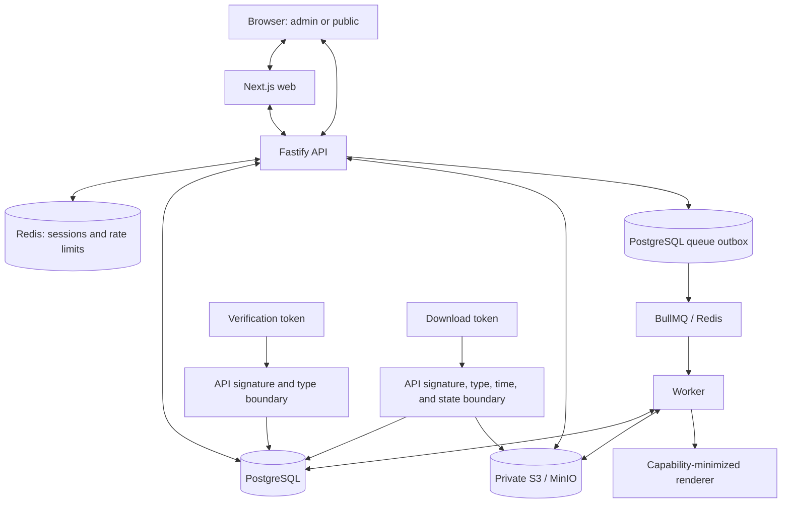

# Repository Threat Model

Status: Final Phase 7 security-testing state, 2026-08-27. Milestones 1, 2, and 3 are complete locally; remote CI remains the final external completion check.

This is the canonical, source-backed threat model for the implemented repository. It describes deployed code boundaries and documented contracts rather than a generic checklist. `docs/23-threat-model.md` remains the earlier architectural summary; this document adds the route, control, and test-level evidence required by Phase 7.

## Scope

The modeled system consists of:

- the Next.js administrative and public-verification web application (`apps/web`);
- the Fastify API and its admin and public routes (`apps/api/src/app.ts`, `apps/api/src/routes`);
- the asynchronous worker (`apps/worker/src`);
- PostgreSQL and the Kysely repositories and migrations (`packages/database`);
- Redis-backed sessions and rate limits (`packages/auth`, `apps/api/src/infrastructure/auth-redis-store.ts`);
- BullMQ and the transactional queue outbox (`packages/queue`, `apps/api/src/modules/phase-five`);
- private S3/MinIO object storage (`packages/storage`);
- the versioned template engine and capability-minimized certificate renderer (`packages/template-engine`, `packages/certificate-renderer`);
- stable certificate verification tokens and short-lived certificate download tokens (`packages/domain/src/certificate-verification-token.ts`, `packages/domain/src/certificate-download-token.ts`);
- admin authentication, browser session, CSRF, and organization authorization flows (`apps/api/src/modules/auth`, `apps/web/src`); and
- public verification, download authorization, and download redemption (`apps/api/src/modules/phase-six`, `apps/api/src/routes/public-*`).

The dedicated malicious upload, template, renderer, and PDF corpus expansion is covered by Phase 7 Milestone 2. Milestone 3 completed the final runtime inventory, Standard Security Scan, invariant/leakage review, and broad resource-abuse sweep. Phase 8 deployment controls remain outside this application-security phase.

## Security assets

| Asset | Required property | Source of truth |
| --- | --- | --- |
| Admin account control | Password policy, generic login failure, disabled-user rejection, and server-resolved authority | `packages/auth/src/password.ts`; `apps/api/src/modules/auth/authentication-service.ts` |
| Redis sessions | Opaque random IDs, bounded lifetime, rotation at login, deletion at logout, and failure closed when unavailable | `packages/auth/src/session-store.ts`; `apps/api/src/modules/auth/authentication-service.ts` |
| CSRF tokens | Bound to one server-side session and checked with exact allowed Origin before mutation | `apps/api/src/modules/auth/authentication-service.ts`; `apps/api/src/modules/auth/organization-authorization-service.ts` |
| Organization authorization state | Active memberships, system roles, organization roles, and permissions are resolved from PostgreSQL | `packages/database/src/authentication-repository.ts`; `packages/domain/src/authorization.ts` |
| Participant and private data | Tenant-scoped access only; no unnecessary public projection | `packages/database/src/phase-three-repository.ts`; `apps/api/src/modules/phase-six/public-verification-service.ts` |
| Immutable issuance snapshots | Issuance identity and binding fields cannot follow mutable live rows | `packages/database/src/certificate-generation-repository.ts`; schema immutability triggers |
| Certificate lifecycle state | Revocation is terminal; stale generation cannot republish or replace current PDF identity | PostgreSQL schema triggers; `packages/database/src/certificate-generation-repository.ts` |
| Generated PDFs | Private, integrity-described objects linked to the issuing renderer/template revision | `apps/worker/src`; `packages/storage`; `packages/database/src/certificate-generation-repository.ts`; `packages/database/src/public-certificate-download-repository.ts` |
| Private storage objects | Never exposed by storage key; reads occur only after trusted authorization and state checks | `packages/storage`; `apps/api/src/modules/phase-six/public-certificate-download-service.ts` |
| Verification signing keys | Remain backend configuration; selected by strict `kid`; never supplied to the renderer | `packages/config`; `packages/domain/src/certificate-verification-token.ts` |
| Verification tokens | Strict, signature-authenticated public capabilities with a canonical `pcid` | `packages/domain/src/certificate-verification-token.ts` |
| Download tokens | Strict, audience-separated, maximum-60-second bearer capabilities with non-public `jti` | `packages/domain/src/certificate-download-token.ts` |
| Audit records | Tenant/actor/action evidence written with security events and relational mutations | `packages/database/src/authentication-repository.ts`; `packages/database/src/audited-transaction.ts`; `apps/api/src/modules/auth` |
| Template assets and definitions | Private, validated, tenant-scoped, version-bound inputs to a restricted renderer | `apps/api/src/modules/phase-four`; `packages/template-engine`; `packages/certificate-renderer` |

## Attacker profiles

- **Unauthenticated Internet attacker.** Can reach public HTTP routes and admin login, supply arbitrary headers and bodies, and make sequential or concurrent requests. This attacker has no assumed database, Redis, storage, signing-key, or internal-network access.
- **Authenticated low-privilege organization member.** Has a valid admin session and one or more server-resolved memberships but lacks permissions for some operations. The browser may forge body fields and headers, but cannot add server-side permissions.
- **Administrator in another organization.** Has legitimate authority in organization B and may know UUIDs belonging to organization A. Knowledge of an internal identifier is not authority.
- **Public verification-token holder.** May verify the certificate state permitted by the public contract and request a download capability when the certificate is currently downloadable. The token grants no administrative or raw storage access.
- **Expired or stolen download-token holder.** Can replay or tamper with a bearer token, but cannot extend its authenticated lifetime or use it after certificate state/publication changes.
- **Malicious participant-import or template-content supplier.** Can supply supported import or template inputs through an authorized organization workflow. M2 proves bounded CSV records/rows, bounded and pre-inspected OOXML, strict template/binding data, validated private asset bytes, and a capability-minimized renderer with no filesystem, network, database, queue, authentication, storage, or signing capability.
- **Resource-exhaustion attacker.** Can send bursts, oversized public bodies, malformed tokens, and repeated authentication attempts. They cannot choose trusted proxy metadata under the current Fastify configuration.

No profile assumes shell access, database credentials, Redis credentials, storage credentials, production secrets, or a compromised trusted administrator unless a separate deployment threat explicitly grants it.

## Trust boundaries

The browser is untrusted. Redis session records and PostgreSQL authorization data are trusted only after successful backend reads. Queue payloads and storage bytes cross asynchronous/untrusted-data boundaries and are validated before use. The renderer receives validated render data, validated bytes, and a final verification URL; it does not import network, database, queue, storage, auth, filesystem, or signing-key capabilities (`tests/security/certificate-renderer-boundary.test.ts`).

## Entry points

Implemented synchronous entry points are:

- operational API routes: `/health/live`, `/health/ready`, and the development OpenAPI route;
- admin authentication: `POST /api/admin/auth/login`, `GET /api/admin/auth/session`, and `POST /api/admin/auth/logout` (`apps/api/src/routes/admin-auth.ts`);
- organization-scoped projects and trainings (`/api/admin/projects*`, `/api/admin/trainings*`);
- organization-scoped participants, participant imports, and jobs (`/api/admin/participants*`, `/api/admin/participant-imports*`, `/api/admin/jobs/:jobId`);
- organization-scoped templates, versions, previews, and assets (`/api/admin/templates*`);
- organization-scoped certificate generation (`POST /api/admin/trainings/:trainingId/certificates/generate`);
- public token verification (`POST /api/public/verify`);
- public download authorization (`POST /api/public/certificates/download-authorize`);
- public download redemption (`POST /api/public/certificates/download`); and
- the public browser fragment flow `/verify#token=...`, which removes the fragment and posts the token in JSON (`apps/web/src`).

Asynchronous entry points are the transactional queue outbox dispatcher, BullMQ participant-import validation/confirmation and certificate-generation messages, worker storage reads/writes, and renderer invocation. They are versioned and schema-validated at their receiving boundaries.

There are no public GET routes that accept a raw certificate UUID, `pcid`, certificate number, participant/student reference, or storage key as download authority.

## Security invariants

1. An organization A membership cannot read or mutate organization B projects, trainings, participants, jobs, templates, versions, assets, generation plans, or certificates.
2. A caller-controlled organization header selects a context only. Permission comes from a current server-resolved active membership or an explicitly allowed system-role bypass.
3. Internal UUID knowledge, nested foreign identifiers, body roles, and body permissions never prove authority.
4. An organization membership role named `SUPER_ADMIN` cannot become a system `SUPER_ADMIN`; the domain separates `systemRoles` from membership roles and PostgreSQL forbids `SUPER_ADMIN` in `membership_roles`.
5. Session IDs and CSRF tokens are cryptographically random server values. Login rotates the session ID, logout deletes it, and authorization-version or user-status changes invalidate stale authority on the next authenticated request.
6. The admin cookie is `__Host-admin_session; Secure; HttpOnly; SameSite=Lax; Path=/` with no `Domain`.
7. Every implemented state-changing authenticated admin route validates a session-bound CSRF token and an exact allowed Origin before domain mutation.
8. Unknown, inactive, and wrong-password login attempts have the same public failure contract; unknown/inactive handling still performs password verification against a dummy bcrypt hash without wall-clock assertions.
9. Passwords are counted in UTF-8 bytes, never normalized or truncated, and new bcrypt inputs above 72 bytes are rejected while the configured cost floor remains enforced.
10. Redis failures during security-critical session or rate-limit operations do not fall back to browser state or in-memory authority.
11. Verification and download token compact syntax, JSON fields, type, version, algorithm, key ID, signature, and canonical `pcid` are authenticated before certificate lookup. The token types are not interchangeable.
12. Download-token time and audience checks occur before avoidable database/storage work. A valid token still cannot download a certificate that is no longer `AVAILABLE` with matching current publication metadata.
13. Revocation is terminal and prevents download. Public security-equivalent failures use `PUBLIC_REQUEST_FAILED` / `The request could not be completed.` where the API contract requires non-enumeration.
14. Public rate-limit increments and expiry assignment are one Redis Lua operation shared by API instances. With `trustProxy` unset, attacker-supplied forwarding headers do not change `request.ip`.
15. Passwords, session IDs, CSRF tokens, verification/download tokens, signing/HMAC keys, and raw `jti` values are redacted and are not intentionally serialized in application errors.
16. Public verification tokens are carried in the initial URL fragment only, then in an in-memory JSON POST. Download tokens remain in memory and are never placed in a path, query, cookie, local storage, session storage, or link target.
17. Participant-import bytes are bounded by multipart and private-storage reads. CSV UTF-8, record size and row count are bounded while parsing; XLSX entry count, individual/cumulative expansion, normalized paths, duplicate paths and sparse worksheet coordinates are checked before ExcelJS materializes the workbook.
18. Participant XLSX rejects encrypted archives, multiple worksheets, external relationship targets, external-link/macro/embedding/OLE parts and formula/object values. OOXML validation does not fetch a relationship target.
19. Template asset uploads are raw-byte bounded before storage, use server-generated object keys, allow only PNG/JPEG/TTF/OTF, and recheck declared MIME, signature, raster container/dimensions/pixels and bounded SFNT structure.
20. Template definitions reject unknown and prototype-sensitive keys, dynamic binding paths and infrastructure/resource fields. Suspicious literal text remains literal; definitions cannot express image/font URLs or local paths.
21. Render inputs are strict and versioned, accept exactly purpose-compatible/hash-matched copied assets within an aggregate budget, and accept only credential-free/query-free absolute HTTP(S) verification URLs within qrcode's guaranteed byte-mode capacity. The URL is QR data, never a fetch target.
22. PDF output is capped incrementally while PDFKit emits chunks. Renderer errors destroy/settle the stream, return no partial accepted PDF, and worker/database publication guards keep failed output from `AVAILABLE` and on durable storage cleanup paths.

## Threat scenarios

| Scenario | Attack path | Control and evidence | Result |
| --- | --- | --- | --- |
| Cross-tenant IDOR | Valid A session + B UUID in path/body, including nested IDs | Authorization selects A; every repository query carries `organization_id`; PostgreSQL integration tests substitute B project/training/participant/job/template/version/asset IDs | Denied with no B mutation or existence disclosure beyond the contract |
| Organization selector confusion | Missing, malformed, nonexistent, foreign, or stale organization header | Strict UUID header schema plus current membership authorization before service access | 400/403 before domain work; valid selector alone grants nothing |
| Privilege confusion | Viewer/template manager/body claim attempts generation or administration | `authorizeOrganizationPermission` consumes only effective identity; Phase 3/4/5 negative route tests assert service not called | Denied |
| System-role collision | Membership role string `SUPER_ADMIN` with explicit bypass enabled | Separate `systemRoles` field plus PostgreSQL `CHECK (role <> 'SUPER_ADMIN')` | Denied |
| Stale authority | Membership/role/user changed after login | Effective identity is reloaded and its authorization hash compared on authenticated requests | Redis session deleted and request rejected |
| Session fixation | Login request contains attacker-known/stale cookie | A new random session is created and prior supplied ID is not retained | Rotated |
| Cross-session CSRF | Random, malformed, other-session, rotated-session, logged-out-session token | Constant-time session-bound comparison plus exact Origin validation before permission/domain calls | Denied without mutation |
| Login enumeration | Unknown/inactive/existing wrong-password probes | Generic response; dummy bcrypt verification for unavailable accounts | No semantic account disclosure |
| Redis auth failure | Redis get/set/delete/increment fails | Exception becomes safe service unavailable; no client/local fallback exists | Fails closed |
| Verification token forgery | `alg:none`, alternate algorithm, malformed/duplicate JSON, unknown `kid`, tampered segment, raw ID | Strict parser and HMAC verification before repository call | Generic failure; no lookup for unauthenticated tokens |
| Token-type confusion | Verification token at download redemption or download token at verification | Protected/payload `typ`, audience, and schema separation | Rejected before resource access |
| Expired/stolen download token | Future `iat`, expiry boundary, excessive TTL, tamper, or post-issuance revocation/archive | Authenticated time validation, maximum lifetime, then current publication/state lookup | Rejected before avoidable work or before storage |
| Public enumeration | Compare malformed/unknown/non-public/missing/corrupt cases | Uniform public error envelope and no sensitive response fields | Semantically generic |
| Forwarded-header bypass | Vary `X-Forwarded-For`, `Forwarded`, or `X-Real-IP` | Fastify `trustProxy` is not enabled; route test observes the same network bucket | Headers ignored |
| Distributed rate-limit race | Concurrent burst split across limiter/API instances | Atomic Redis Lua `INCR`/`EXPIRE`; real-Redis integration asserts exact allowed count | Limit cannot be materially raced |
| Oversized public verify body | Large JSON is parsed before route limiter | Per-route 4 KiB Fastify `bodyLimit`; regression asserts limiter/repository are not called | Rejected before route work |
| Capability leakage in logs | Cause errors with sensitive fields | Pino redaction paths and public response/log tests | Values redacted; broader audit continues in M3 |
| Malicious CSV | Invalid UTF-8/NUL, malformed quotes/delimiters, duplicate/unknown headers, oversized record, row overflow and formula-looking literals | API UTF-8/signature boundary plus parser-time 4 KiB record and configured row caps; bounded table-driven corpus | Invalid content fails deterministically; formula-looking text remains literal because no spreadsheet export sink exists |
| XLSX decompression/path abuse | Encrypted/truncated ZIP, excess entries/expanded bytes, duplicate/absolute/traversal paths and sparse extreme coordinates | Lazy yauzl pre-inspection before ExcelJS; normalized path uniqueness; per-entry/cumulative/row/column limits | Rejected before workbook materialization without a decompression-bomb fixture |
| OOXML active/external content | External relationships/hyperlinks, external links, macros, embeddings and OLE parts | Relationship XML and content-type inspection plus forbidden-part checks; formula/object cell validation | Rejected; no network client or fetch occurs |
| Template asset confusion | MIME/signature mismatch, truncated/animated raster, oversized dimensions/pixels, WOFF/TTC/fake or malformed SFNT | Multipart raw-byte cap, PNG/JPEG container and Sharp metadata profile, bounded SFNT directory, purpose/MIME checks again at render | Rejected or contained at the controlled downstream font/image parser boundary |
| Template/binding injection | Unknown/prototype keys, dynamic property paths, expression/XSS/SSRF/path strings | Strict versioned Zod objects, iterative prototype-key precheck, enum binding resolver and asset UUID references only | Expressions are never evaluated; safe suspicious literals remain data |
| Renderer capability expansion | Add database/Redis/BullMQ/S3/auth/signing/filesystem/network/process/eval capability | Source/dependency boundary test and strict render schema | Build/test fails; renderer retains only PDFKit/qrcode/template-engine/Zod capabilities |
| Render/PDF resource abuse | Maximum elements/text/assets, impossible QR payload, PDF output beyond budget, malformed image/font | Schema/binder/asset caps, 2,331-byte QR URL cap, incremental PDF stream cap and controlled parser-error tests | Fails boundedly with no partial accepted PDF |
| Worker publication after renderer failure | Bad render input/output, asset substitution or publication failure | Hash/size/signature rechecks, PostgreSQL item/lifecycle guards and durable cleanup outbox integration | Certificate is not published `AVAILABLE`; current valid publication is not replaced |

## Existing mitigations

- Password validation and bcrypt cost/byte-boundary handling: `packages/auth/src/password.ts` and `packages/auth/src/password.test.ts`.
- Session creation, rotation, authorization-version checking, CSRF, Origin, logout, and failure behavior: `apps/api/src/modules/auth/authentication-service.ts`, `apps/api/src/routes/admin-auth.test.ts`, `apps/api/tests/integration/authentication.integration.test.ts`, and `apps/api/tests/integration/session-revocation.integration.test.ts`.
- Tenant permission decisions and role separation: `packages/domain/src/authorization.ts`, `packages/domain/src/authorization.test.ts`, `tests/security/rbac-tenant-isolation.test.ts`, and the Phase 3-5 security/integration tests.
- Verification/download token strictness and type separation: `packages/domain/src/certificate-verification-token.test.ts`, `packages/domain/src/certificate-download-token.test.ts`, and Phase 6 API integration tests.
- State-aware public database and storage behavior: `apps/api/tests/integration/public-verification.integration.test.ts` and `apps/api/tests/integration/public-certificate-download.integration.test.ts`.
- Distributed public rate limits: `packages/auth/src/public-verification-rate-limiter.ts`, `apps/api/src/infrastructure/auth-redis-store.ts`, and `apps/api/tests/integration/public-rate-limit-abuse.integration.test.ts`.
- Public browser transport: `tests/e2e/phase-six.spec.ts`.
- Renderer capability restriction: `tests/security/certificate-renderer-boundary.test.ts`.
- Malicious CSV/XLSX, ZIP/OOXML and cell-value corpus: `apps/worker/src/processors/participant-import-parser.test.ts`; terminal cleanup proof: `apps/worker/tests/integration/participant-import.integration.test.ts`.
- Participant/template upload byte and server-generated-key boundaries: `apps/api/tests/integration/phase-three.integration.test.ts`, `apps/api/tests/integration/phase-four.integration.test.ts`, and their module-local upload tests.
- Image/font validation and controlled downstream malformed-font behavior: `apps/api/src/modules/phase-four/template-asset-upload.test.ts` and `packages/certificate-renderer/src/render.test.ts`.
- Strict template/binder/prototype/literal coverage: `packages/template-engine/src/template-definition.test.ts` and `packages/template-engine/src/data-binder.test.ts`.
- Strict renderer input, asset identity/budget, QR and incremental PDF behavior: `packages/certificate-renderer/src/render-input.test.ts` and `packages/certificate-renderer/src/render.test.ts`.
- Renderer failure/publication containment: `apps/worker/tests/integration/certificate-generation.integration.test.ts`.
- Structured redaction: `packages/config/src/logging.ts` and `packages/config/src/logging.test.ts`.
- Database constraints, immutable issuance inputs, revocation, and stale-generation protections: `docs/09-postgresql-schema.sql`, database migration tests, and certificate integrity/generation integration tests.

## Required Phase 7 tests

- **Milestone 1:** access-control/IDOR, role confusion, session lifecycle/fixation/revocation, CSRF/Origin, password and login behavior, Redis fail-closed behavior, public capability parsing/type/state/error abuse, proxy-header behavior, distributed rate-limit atomicity, and targeted capability redaction.
- **Milestone 2:** malicious CSV/XLSX and OOXML relationships, image/font metadata, template injection/XSS/SSRF/path traversal, renderer resource exhaustion, and adversarial PDF inputs are covered by the source-backed tests listed above.
- **Milestone 3:** completed final full-repository Standard Security Scan, complete secret/PII leakage review, error/header/browser/queue/database/storage review, broad resource-abuse limits, and the Phase 7 completion gate.
- **Phase 8 deployment validation:** explicit reverse-proxy trust/CIDR configuration, production TLS and secure-cookie termination, managed secret/key operations, network policies, process isolation, production object-store policy, monitoring, backups, and incident runbooks.

## Security coverage gap matrix

`Existing coverage` includes every file selected by root `pnpm test:security` and the security-relevant real-infrastructure suites selected by `pnpm test:integration`; it is not limited to `tests/security`.

| Threat / invariant | Existing coverage | Gap | Milestone | Status |
| --- | --- | --- | --- | --- |
| Phase 3 project/training/participant/import/job tenant isolation | Route authorization tests and PostgreSQL Phase 3 integration | Foreign path/body/nested ID matrix added in M1 | M1 | COVERED |
| Phase 4 template/version/asset tenant isolation | Route permission tests and PostgreSQL Phase 4 integration | Bidirectional nested foreign-ID and no-mutation cases added in M1 | M1 | COVERED |
| Phase 5 generation tenant/participant/template isolation | PostgreSQL Phase 5 integration | Foreign participant plus service-boundary permission cases added in M1 | M1 | COVERED |
| Admin certificate CRUD tenant isolation | No admin certificate read/update/revoke route is implemented | Test when such an entry point exists; generation/public boundaries are covered | Future feature | NOT_APPLICABLE |
| Organization selector confusion | Phase 3/4/5 route security and integration tests | None in implemented route groups | M1 | COVERED |
| Viewer/template/generation privilege confusion | Domain authorization and Phase 3/4 route tests | Phase 5 template-role and forged system-role cases added in M1 | M1 | COVERED |
| Membership `SUPER_ADMIN` collision | Domain system-role separation | Route misuse and PostgreSQL membership constraint proof added in M1 | M1 | COVERED |
| Stale membership/role/user authority | Auth route tests and real Redis/PostgreSQL integration | None | M1 | COVERED |
| Session fixation, rotation, logout, cookie flags | Admin-auth route tests | Deterministic attacker-known-cookie replacement and replay cases added in M1 | M1 | COVERED |
| CSRF cross-session/rotation/logout replay | Admin-auth and phase route tests | Expanded cross-session and post-logout cases added in M1 | M1 | COVERED |
| Exact Origin matching | Auth service and route tests | Prefix/subdomain/scheme/port/path abuse matrix added in M1 | M1 | COVERED |
| Bcrypt UTF-8 72-byte boundary | Password primitive tests | Unicode byte/character, truncation collision, and normalization cases added in M1 | M1 | COVERED |
| Login enumeration and dummy bcrypt | Generic route tests | Structural verifier seam assertions added without timing thresholds | M1 | COVERED |
| Redis auth-state failure closed | Auth service/route tests and Redis integration | None | M1 | COVERED |
| Verification-token parser/signature abuse | Domain token tests and public integration | Duplicate JSON, unknown fields, canonical encoding, malformed `kid`, and raw-ID cases added in M1 | M1 | COVERED |
| Download-token type/time/signature/state abuse | Domain tests and download integration | Duplicate JSON, canonical encoding, malformed `kid`, internal UUID, and explicit type-confusion coverage added in M1 | M1 | COVERED |
| Signature/time failure before DB/storage | Service unit tests with repository/storage spies | None | M1 | COVERED |
| Generic public errors and response minimization | Phase 6 route/integration tests | Oversized verify-body case added in M1 | M1 | COVERED |
| Raw public identifier as authority | Strict token parsing and POST-only routes | Explicit raw `pcid`/UUID/number/reference/storage-key route corpus added in M1 | M1 | COVERED |
| Redis rate-limit sharing and atomicity | Phase 6 distributed integration | Concurrent exact-count and deterministic isolated-state reset added in M1 | M1 | COVERED |
| Untrusted forwarding-header bypass | Default Fastify configuration | Explicit header abuse route test added; production proxy model remains deployment work | M1 / Phase 8 | COVERED |
| Public token browser transport | Phase 6 Playwright security coverage | None unless browser implementation changes | M1 | COVERED |
| M1 capability log redaction | Existing Pino redaction tests | Verification token, signing/HMAC key, and raw `jti` paths added | M1 | COVERED |
| CSV byte/record/row/header/malformed-input bounds | API upload, worker parser and domain row validation | Parser-time record/row and deterministic literal/malformed corpus added in M2 | M2 | COVERED |
| XLSX ZIP expansion, encryption and traversal | Signature check plus yauzl pre-inspection | Entry/individual/cumulative bounds, duplicate/normalized paths and sparse coordinate corpus added in M2 | M2 | COVERED |
| OOXML external/macro/embedded/formula content | Forbidden filename checks and ExcelJS row validation | Relationship/content-type inspection and external hyperlink/object/formula corpus added in M2 | M2 | COVERED |
| Participant terminal failure cleanup | Durable source cleanup columns/reconciler | Malicious validation failure now proves no staged/participant partial state and successful source deletion | M2 | COVERED |
| Template asset byte/MIME/image/font bounds | Multipart limits, Sharp and SFNT validator | Raw-byte integration, confusion/container/dimension/format/SFNT corpus and malformed downstream parser containment added | M2 | COVERED |
| Template schema, binding, prototype and literal injection | Strict Zod schema and explicit resolver | Unknown-field/binding/prototype/path/SSRF-like/literal corpus added; no interpretation or prototype mutation | M2 | COVERED |
| Renderer strict input, capability and asset identity | Versioned schema, hash/purpose/budget checks and dependency test | URL-scheme/QR byte boundary, mutation, exact budget and expanded forbidden-capability coverage added | M2 | COVERED |
| PDF output and worker failure containment | Post-render PDF checks and durable publication transactions | Incremental output cap, stream-error cleanup, malformed assets and no-publication integration proof added | M2 | COVERED |
| Secret, credential, error-object and stack leakage | Central path redaction, fixed HTTP error envelopes, safe job codes | Error serialization retains only a bounded class name and redacted message/stack; repository paths and caught exceptions reviewed | M3 | COVERED |
| Public PII and internal-identifier minimization | Public verification/download projections and integration assertions | Public responses re-audited; revoked response stays minimal and storage/revision/key fields remain absent | M3 | COVERED |
| Request ID, headers, mass assignment and object merging | Server UUID IDs, static headers, strict schemas and explicit repository fields | Injection and trust-changing unknown-field corpus plus non-template merge review completed | M3 | COVERED |
| SQL/query construction, cursor and identifier abuse | Parameterized Kysely, UUID schemas, AES-GCM scoped cursor | Raw/dynamic query review plus byte-tamper, malformed, oversized and cross-scope cursor proofs | M3 | COVERED |
| HTTP body, multipart and pagination bounds | Explicit JSON/body/upload limits and cursor pagination | Field/file/boundary abuse, generation cap and version/asset list regressions added | M3 | COVERED |
| Redis, cache and browser capability confidentiality | HMAC keys, independent buckets, no-store/noindex and memory-only tokens | Successful/error browser paths and login audit threshold behavior reviewed | M3 | COVERED |
| Queue, database, transaction and storage invariants | Strict messages, PostgreSQL constraints, state rechecks and object integrity | Replay/cleanup/TOCTOU/key-confusion/incremental-read review completed | M3 | COVERED |
| Privacy minimization and package capability direction | Minimal models and package-boundary tests | No prohibited new data or renderer/template/domain infrastructure capability found | M3 | COVERED |
| Production proxy/TLS/network/key-management controls | Application fails safe with `trustProxy` unset and production MFA startup blocked | Requires Phase 8 topology, secret operations, ingress and operational evidence | Phase 8 | BLOCKED |

## Milestone 3 final audit

The final runtime inventory covered the Next.js browser surface; every operational, authentication, tenant-admin, import, template, generation, verification and download Fastify route; participant-import/generation/outbox worker paths; PostgreSQL, Redis/BullMQ and S3/MinIO; and the auth, domain, config/logging, database, queue, storage, template-engine and certificate-renderer packages. Documentation-only paths and unimplemented certificate-admin endpoints were not treated as runtime attack surfaces.

The Standard Security Scan and source validation found four application-owned resource/audit issues, all remediated in M3: unbounded generation cardinality (Medium), login rate-limit audit amplification (Medium), missing atomic generation audit evidence (Low), and unbounded template-version/asset lists with quadratic link association (Low). Meaningful rejected candidates included safe parameterized Kysely construction, strict mass-assignment/prototype boundaries, generic external errors, server-generated headers/storage keys, queue forgery without Redis authority, storage cleanup races without attacker-reachable prerequisites, and capability persistence without a browser sink.

Readiness exposure, client-address preservation behind a future proxy, production OpenAPI policy, renderer process/container isolation, object-store bucket policy, audit retention, credential separation, TLS, monitoring, backup, and incident response are Phase 8 deployment prerequisites. The API cannot currently start in production because the intentional MFA gate remains active. These controls are `BLOCKED` for repository-only proof, not unexplained Phase 7 gaps.

### Resource limit matrix

| Input/resource | Bound | Enforcement layer | Test/evidence |
| --- | --- | --- | --- |
| General API JSON | 1 MiB | Explicit Fastify `bodyLimit` | `apps/api/src/app.ts`; API error suites |
| Public verify/authorize/redeem JSON | 4 KiB each | Route `bodyLimit` before handler | public abuse/integration tests |
| Login email/password | 320 characters / 72 UTF-8 bytes | strict contracts | authentication/password tests |
| Admin strings, arrays and list pages | Contract maxima; pages 1-100, default 50 | Zod, cursor and SQL `LIMIT limit+1` | Phase 3/4 and M3 boundary tests |
| Identifiers/cursors | UUID schemas; cursor 2,048 bytes | route schema and cursor codec | malformed/tamper/scope tests |
| Certificate generation set | 1-1,000 exact participants | request schema and planner `LIMIT 1001` | M3 boundary and PostgreSQL tests |
| Multipart uploads | one file, zero fields, one part | global multipart limits | Phase 3/4 multipart tests |
| Participant source and CSV | 5 MiB default; 4 KiB record; 10,000 rows default | upload/storage and streaming parser | malicious CSV corpus |
| XLSX/ZIP | 1,000 entries; 25 MiB expanded default; bounded paths/rows/columns | yauzl preflight before ExcelJS | malicious OOXML corpus |
| Template definition | strict version; at most 100 bounded elements | template schema | template/binder tests |
| Raster/font assets | upload bytes plus bounded pixels/frames/SFNT tables | asset validators | image/font corpus |
| Queue payload | fixed versioned UUID/enum object; strict unknown-field rejection | queue schemas | queue and M3 tests |
| Render assets/QR/PDF | configured aggregate; QR 2,331 UTF-8 bytes; PDF 10 MiB default | render-input and incremental renderer | renderer tests |
| Private storage read | declared and incremental cumulative maximum | S3 stream loop | missing-length/cap-crossing tests |
| Redis rate-limit state | fixed HMAC key, integer counter, bounded TTL | atomic Lua/config | real-Redis tests |

## Residual risks

### Accepted design

- Verification and download capabilities are bearer tokens. An authorized holder can replay a still-valid token; download lifetime is capped at 60 seconds and every redemption rechecks current certificate state and publication metadata.
- Download `jti` is entropy and correlation material inside the signed capability, not a public identifier or a server-side one-time-use store. One-time redemption is not the approved contract.
- Public verification intentionally reports the minimal revoked result defined by the API contract. Revocation reason and recipient/program data are withheld.

### Phase 8 deployment risks

- The application currently leaves Fastify `trustProxy` disabled, so untrusted forwarding headers are ignored. A production reverse proxy must define explicit trusted hops/CIDRs before enabling proxy trust; enabling broad `trustProxy: true` would make address-based limits spoofable.
- TLS termination, production cookie transport, network segmentation, managed signing-key rotation, Redis/PostgreSQL/MinIO credentials, process/container restrictions, monitoring, backup, and incident-response controls require deployment evidence. Their absence at this phase is deployment risk, not a demonstrated application vulnerability.

### Validated findings

The initial standard Codex Security scan produced one validated Low-severity finding: `/api/public/verify` used Fastify's default body parser limit before reaching its Redis-backed route limiter. M1 added a 4 KiB route `bodyLimit` and regression coverage.

M2's targeted source tracing validated three Low-severity availability/correctness findings, each requiring an authenticated organization workflow and each already bounded by upstream input limits: CSV rows were collected before the configured row check, PDF chunks were retained until rendering completed before the output-byte check, and the 4,096-character verification URL schema admitted QR payloads beyond qrcode's byte-mode capacity. M2 now enforces rows/records while parsing, caps PDF chunks incrementally with stream cleanup, and validates verification URLs at the measured 2,331-byte qrcode capacity. M2 also closed non-exploitable contract gaps for OOXML external-relationship rejection, explicit prototype-sensitive key rejection, multipart oversize classification, and PNG animation/truncation structure; no SSRF, code execution, prototype pollution or renderer capability escape was reproduced.

M3 remediated the four validated findings described above. Defense-in-depth changes also made caught `Error` serialization content-independent, made private S3 reads stop incrementally when `ContentLength` is missing or false, made admin-auth error responses uniformly `no-store`, made the global JSON-parser bound explicit, and tightened direct cursor decoding.

No unresolved validated Critical, High, Medium or Low findings were identified within the tested Phase 7 scope. This is calibrated evidence for the implemented repository and test conditions, not a claim that the software is perfectly secure or vulnerability-free. Final Phase 7 completion additionally requires the M3 remote Quality and Integration gates to succeed.
